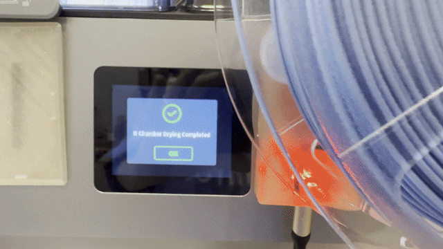

# Voron NFC Spoolman Integration

Automatic filament spool tracking for multi-toolhead Voron printers using NFC tags, ESP32-S3, and Spoolman.


## Overview

Scan an NFC tag on a filament spool → automatically sets the active spool in Spoolman → updates Fluidd per toolhead → Klipper tracks filament usage → LED on each toolhead confirms the scan and displays the spool color.

```
Scan NFC tag
     ↓
ESP32-S3 + PN532 reads UID
     ↓
ESPHome publishes to MQTT
     ↓
Python middleware on Pi
     ↓
Spoolman lookup by UID
     ↓
Moonraker sets active spool
     ↓
Fluidd shows spool per toolhead
     ↓
LED flashes white 3x (scan confirmed) → holds spool color
```

## LED Status Indicator


Each toolhead's onboard WS2812 RGB LED provides visual feedback. This project is tested with the **Waveshare ESP32-S3-Zero**, which includes an onboard WS2812 LED on GPIO21 — no additional wiring required for the LED.

- **3x white flash** — NFC tag successfully scanned
- **Solid spool color** — displays the filament color pulled from Spoolman after a successful scan

The LED color is published via MQTT and driven by the middleware using the `color_hex` value stored in Spoolman for each spool.

## Hardware

- 4x [Waveshare ESP32-S3-Zero](https://www.waveshare.com/esp32-s3-zero.htm) *(tested and recommended — onboard WS2812 LED on GPIO21)*
- 4x PN532 NFC Module (I2C mode)
- 4x WS2812 RGB LED (onboard on Waveshare ESP32-S3-Zero, GPIO21)
- Raspberry Pi (Klipper host)
- NFC tags (one per spool)

## Software Stack

- [ESPHome](https://esphome.io) — firmware for ESP32-S3
- [Mosquitto MQTT](https://mosquitto.org) — via Home Assistant addon
- [Spoolman](https://github.com/Donkie/Spoolman) — filament database
- [Moonraker](https://moonraker.readthedocs.io) — Klipper API
- [Fluidd](https://fluidd.xyz) — web interface with per-toolhead spool support. Unfortunetly Mainsail only supports one active spool.

## Prerequisites

- Home Assistant with ESPHome and Mosquitto addons
- Klipper + Moonraker running on Raspberry Pi
- Spoolman installed and running
- Fluidd installed (see docs/fluidd-install.md)

## 3D Printed Case

A custom case is included in the `3mf/` directory, modified from [this model on MakerWorld](https://makerworld.com/en/models/2108947-esp32-c3-pn532-nfc-reader-case-usb-c#profileId-2552448).

Modifications made:
- **Toolhead labels** — T0, T1, T2, T3 text added to each case
- **ESP32-S3-Zero fit** — modified bay designed specifically for the Waveshare ESP32-S3-Zero (get the version without pins and solder wires directly)
- **Scan target** — added a scan target area on the case, suggested to print in red filament

**Printing tips:**
- Print the case itself in a **clear material** (PLA, PETG, or PC) to let the onboard LED shine through for full visual effect
- Print the scan target insert in red for easy identification

## Directory Structure

```
├── esphome/          # ESPHome YAML configs for each toolhead
├── middleware/       # Python MQTT listener script
├── klipper/          # Klipper macro configs
├── 3mf/              # 3D printable case files
└── docs/             # Setup guides
```

## Quick Start

1. Wire the PN532 to each ESP32-S3 (see docs/wiring.md)
2. Flash ESPHome configs (see docs/esphome-setup.md)
3. Deploy middleware script (see docs/middleware-setup.md)
4. Add Klipper macros (see docs/klipper-setup.md)
5. Configure Spoolman extra fields (see docs/spoolman-setup.md)

## License

GPL-3.0
