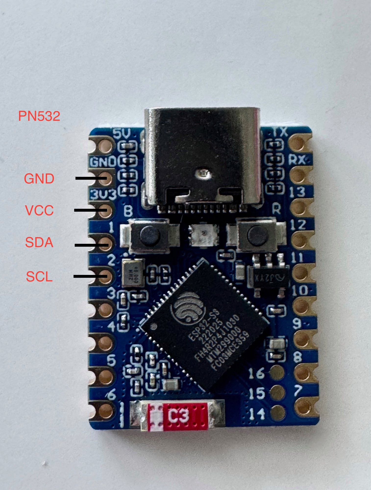

# Wiring Guide

## PN532 DIP Switch Settings (I2C Mode)

Set the DIP switches on the PN532 board as follows:
- Switch 1: **ON**
- Switch 2: **OFF**

## PN532 to ESP32-S3-Zero Wiring

| PN532 Pin | ESP32-S3-Zero Pin |
|-----------|-------------------|
| VCC       | 3V3               |
| GND       | GND               |
| SDA       | GPIO1             |
| SCL       | GPIO2             |

> **Note:** The 3.3V pin on the Waveshare ESP32-S3-Zero is labeled **3V3** on the board.
> Do NOT connect VCC to 5V — the PN532 runs fine on 3.3V.

### Solder Points on the ESP32-S3-Zero

The photo below shows the exact solder points on the Waveshare ESP32-S3-Zero for connecting a PN532 NFC module. Solder wires directly to the castellated pads — get the version without pre-soldered pins for the cleanest fit inside the printed case.



## I2C Address

The PN532 should appear at address **0x24** on the I2C bus.
You can verify this in the ESPHome logs after flashing — look for:
```
Results from bus scan:
Found i2c device at address 0x24
```

## Onboard LED

The Waveshare ESP32-S3-Zero has a built-in WS2812 RGB LED on **GPIO21**. No additional wiring is needed for the status LED — it's part of the board.

## Notes

- Test with dupont wires before soldering
- One ESP32-S3-Zero + PN532 per toolhead (4 total for a toolchanger setup)
- All units use the same GPIO pins since each is a separate device
- Get the ESP32-S3-Zero version **without pins** and solder wires directly for the best fit in the printed case
